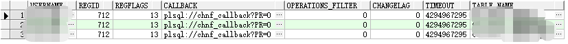

> [jdbc-style官方文档](https://docs.oracle.com/cd/E11882_01/java.112/e16548/dbchgnf.htm#JJDBC28815)
>
> [plsql-style官方文档](https://docs.oracle.com/cd/B19306_01/appdev.102/b14258/d_chngnt.htm#CIHFDFDJ)

1. 授权用户

   ```sql
   CONNECT / AS SYSDBA;
   GRANT CHANGE NOTIFICATION TO test;
   GRANT EXECUTE ON DBMS_CHANGE_NOTIFICATION TO test;
   ```
<!-- more -->
2. 修改任务队列线程数

   ```sql
   CONNECT / AD SYSDBA
   Rem Enable job queue processes to receive notifications.
   ALTER SYSTEM SET "job_queue_processes"=2;
   ```

3. 创建表变化接收表

   ```sql
   CONNECT test/test;
   Rem Create a table to record notification events
   CREATE TABLE nfevents(regid number, event_type number);
    
   Rem create a table to record changes to registered tables
   CREATE TABLE nftablechanges(regid number, table_name varchar2(100),
                               table_operation number);
    
   Rem create a table to record rowids of changed rows.
   CREATE TABLE nfrowchanges(regid number, table_name varchar2(100), 
                             row_id varchar2(30));
   ```

4. 创建存储过程

   ```sql
   CREATE OR REPLACE PROCEDURE chnf_callback(ntfnds IN cq_notification$_descriptor) AS
     regid          NUMBER;
     tbname         VARCHAR2(60);
     event_type     NUMBER;
     numtables      NUMBER;
     operation_type NUMBER;
     numrows        NUMBER;
     row_id         VARCHAR2(20);
   BEGIN
     regid      := ntfnds.registration_id;
     numtables  := ntfnds.numtables;
     event_type := ntfnds.event_type;
   
     INSERT INTO nfevents VALUES (regid, event_type);
     IF (event_type = DBMS_CHANGE_NOTIFICATION.EVENT_OBJCHANGE) THEN
       FOR i IN 1 .. numtables LOOP
         tbname         := ntfnds.table_desc_array(i).table_name;
         operation_type := ntfnds.table_desc_array(I) . Opflags;
         INSERT INTO nftablechanges VALUES (regid, tbname, operation_type);
         /* Send the table name and operation_type to client side listener using UTL_HTTP */
         /* If interested in the rowids, obtain them as follows */
         IF (bitand(operation_type, DBMS_CHANGE_NOTIFICATION.ALL_ROWS) = 0) THEN
           numrows := ntfnds.table_desc_array(i).numrows;
         ELSE
           numrows := 0; /* ROWID INFO NOT AVAILABLE */
         END IF;
         /* The body of the loop is not executed when numrows is ZERO */
         FOR j IN 1 .. numrows LOOP
           Row_id := ntfnds.table_desc_array(i).row_desc_array(j).row_id;
           INSERT INTO nfrowchanges VALUES (regid, tbname, Row_id);
           /* optionally Send out row_ids to client side listener using UTL_HTTP; */
         END LOOP;
       END LOOP;
     END IF;
     COMMIT;
   END;
   ```

5. 注册变化通知

   ``` sql
   DECLARE
     REGDS      CQ_NOTIFICATION$_REG_INFO;
     regid      NUMBER;
     mgr_id     NUMBER;
     dept_id    NUMBER;
     qosflags   NUMBER;
   BEGIN
    qosflags := DBMS_CHANGE_NOTIFICATION.QOS_RELIABLE +
            DBMS_CHANGE_NOTIFICATION.QOS_ROWIDS;
   REGDS := cq_notification$_reg_info ('chnf_callback', qosflags, 0,0,0);
   regid := DBMS_CHANGE_NOTIFICATION.NEW_REG_START (REGDS);
   SELECT count(ID) INTO mgr_id FROM table1 WHERE id = 1;
     SELECT count(id) INTO mgr_id FROM　table2 WHERE id = '1';
   DBMS_CHANGE_NOTIFICATION.REG_END;
   END;
   ```

6. 查看注册状态

   ```sql
   select * from dba_change_notification_regs;
   ```

   

7. 解除注册命令

   ```sql
   call DBMS_CHANGE_NOTIFICATION.DEREGISTER (regid IN NUMBER);
   ```

   