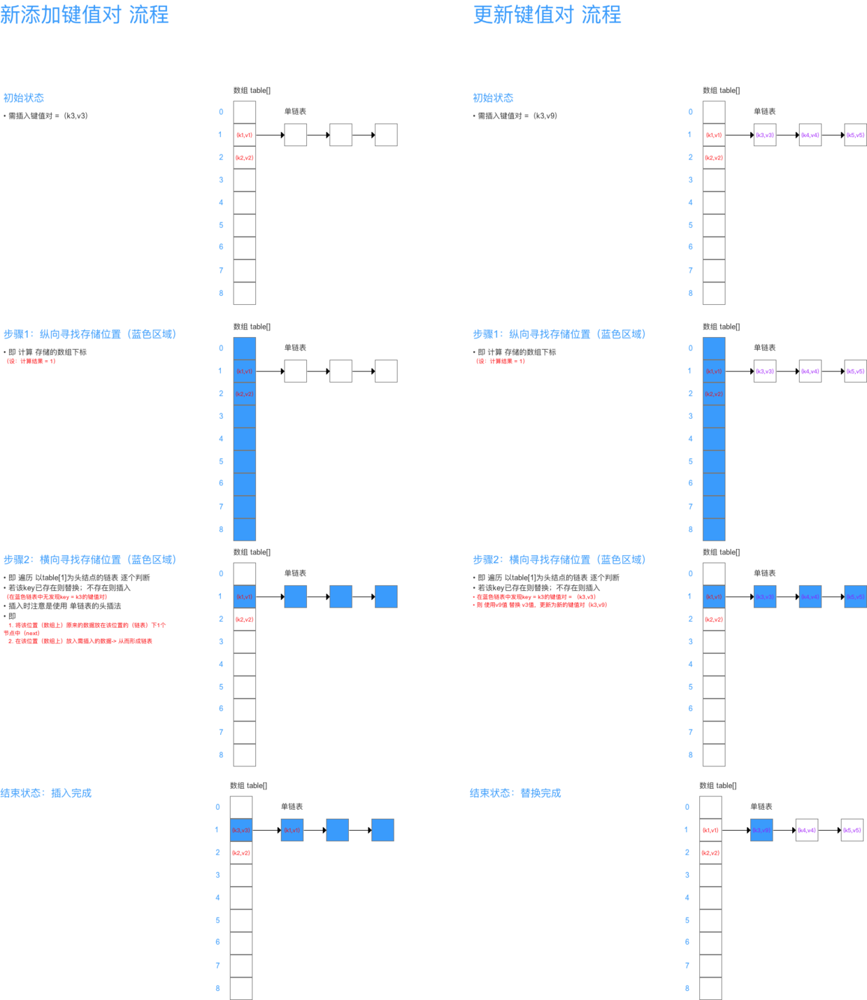
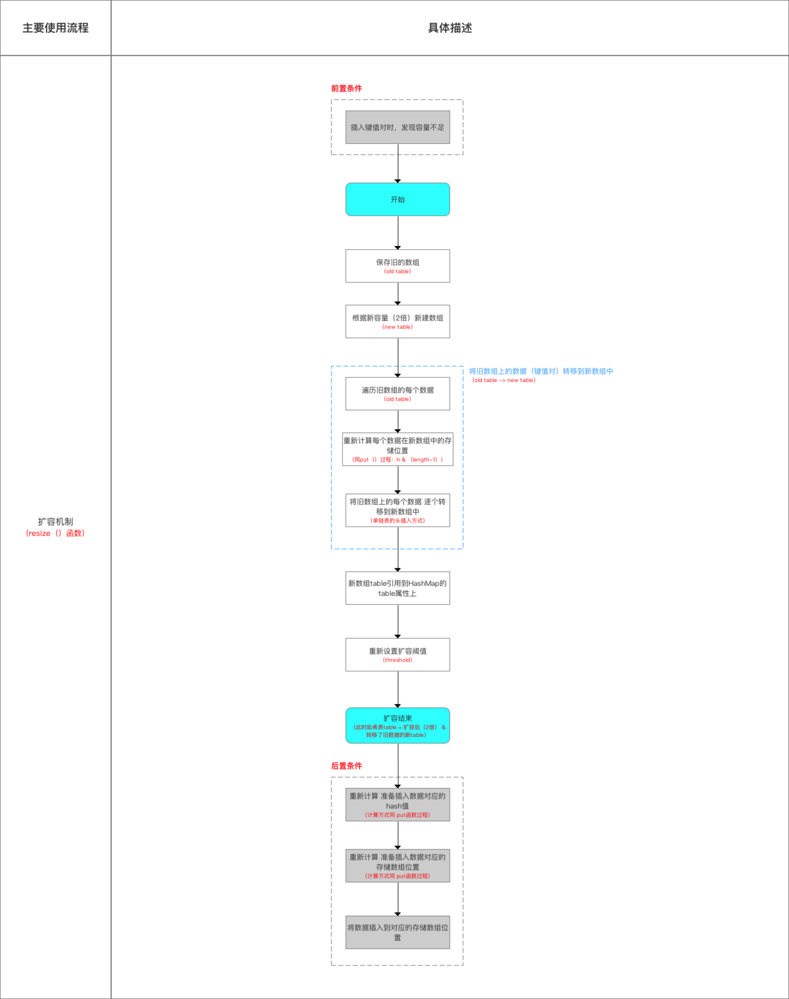

> 摘自：[https://www.cnblogs.com/chengxiao/p/6059914.html](https://www.cnblogs.com/chengxiao/p/6059914.html)
> 摘自：[https://www.cnblogs.com/dijia478/p/8006713.html](https://www.cnblogs.com/dijia478/p/8006713.html)

# 数据结构

&emsp;&emsp;HashMap中的数据结构是数组+单链表的组合，以键值对(key-value)的形式存储元素的，通过put()和get()方法储存和获取对象。

## 什么是哈希表（hash table）

&emsp;&emsp;在讨论哈希表之前，我们先大概了解下其他数据结构在新增，查找等基础操作执行性能

&emsp;&emsp;**数组**：采用一段连续的存储单元来存储数据。对于指定下标的查找，时间复杂度为O(1)；通过给定值进行查找，需要遍历数组，逐一比对给定关键字和数组元素，时间复杂度为O(n)，当然，对于有序数组，则可采用二分查找，插值查找，斐波那契查找等方式，可将查找复杂度提高为O(logn)；对于一般的插入删除操作，涉及到数组元素的移动，其平均复杂度也为O(n)

&emsp;&emsp;**线性链表**：对于链表的新增，删除等操作（在找到指定操作位置后），仅需处理结点间的引用即可，时间复杂度为O(1)，而查找操作需要遍历链表逐一进行比对，复杂度为O(n)

&emsp;&emsp;**二叉树**：对一棵相对平衡的有序二叉树，对其进行插入，查找，删除等操作，平均复杂度均为O(logn)。

&emsp;&emsp;**哈希表**：相比上述几种数据结构，在哈希表中进行添加，删除，查找等操作，性能十分之高，不考虑哈希冲突的情况下，仅需一次定位即可完成，时间复杂度为O(1)，接下来我们就来看看哈希表是如何实现达到惊艳的常数阶O(1)的。
<!-- more -->
&emsp;&emsp;我们知道，数据结构的物理存储结构只有两种：**顺序存储结构**和**链式存储结构**（像栈，队列，树，图等是从逻辑结构去抽象的，映射到内存中，也这两种物理组织形式），而在上面我们提到过，在数组中根据下标查找某个元素，一次定位就可以达到，哈希表利用了这种特性，**哈希表的主干就是数组**。

&emsp;&emsp;比如我们要新增或查找某个元素，我们通过把当前元素的关键字 通过某个函数映射到数组中的某个位置，通过数组下标一次定位就可完成操作。

　　　　　　　　**存储位置 = f(关键字)**

&emsp;&emsp;其中，这个函数f一般称为**哈希函数**，这个函数的设计好坏会直接影响到哈希表的优劣。举个例子，比如我们要在哈希表中执行插入操作：


&emsp;&emsp;查找操作同理，先通过哈希函数计算出实际存储地址，然后从数组中对应地址取出即可。

## 哈希冲突

&emsp;&emsp;然而万事无完美，如果两个不同的元素，通过哈希函数得出的实际存储地址相同怎么办？也就是说，当我们对某个元素进行哈希运算，得到一个存储地址，然后要进行插入的时候，发现已经被其他元素占用了，其实这就是所谓的**哈希冲突**，也叫哈希碰撞。前面我们提到过，哈希函数的设计至关重要，好的哈希函数会尽可能地保证**计算简单**和**散列地址分布均匀,**但是，我们需要清楚的是，数组是一块连续的固定长度的内存空间，再好的哈希函数也不能保证得到的存储地址绝对不发生冲突。那么哈希冲突如何解决呢？哈希冲突的解决方案有多种:开放定址法（发生冲突，继续寻找下一块未被占用的存储地址），再散列函数法，链地址法，而HashMap即是采用了链地址法，也就是**数组+链表**的方式。

# HashMap实现原理

## 整体结构


&emsp;&emsp;HashMap的主干是一个Entry数组。Entry是HashMap的基本组成单元，每一个Entry包含一个key-value键值对。

```java
/**

* The table, resized as necessary. Length MUST Always be a power of two.
*/
//HashMap的主干数组就是一个Entry数组，初始值为空数组{}，主干数组的长度一定是2的n次幂
transient Entry<K,V>[] table = (Entry<K,V>[]) EMPTY_TABLE;
```

&emsp;&emsp;Entry是HashMap中的一个静态内部类：

```java
static class Entry<K,V> implements Map.Entry<K,V> {
        final K key;
        V value;
        Entry<K,V> next;
        int hash;

        /**
         * Creates new entry.
         */
        Entry(int h, K k, V v, Entry<K,V> n) {
            value = v;
            next = n;
            key = k;
            hash = h;
        }

        //...

        public final boolean equals(Object o) {
            if (!(o instanceof Map.Entry))
                return false;
            Map.Entry e = (Map.Entry)o;
            Object k1 = getKey();
            Object k2 = e.getKey();
            if (k1 == k2 || (k1 != null && k1.equals(k2))) {
                Object v1 = getValue();
                Object v2 = e.getValue();
                if (v1 == v2 || (v1 != null && v1.equals(v2)))
                    return true;
            }
            return false;
        }

        //...
    }
```

&emsp;&emsp;HashMap的整体结构如下：


&emsp;&emsp;**简单来说，HashMap由数组+链表组成的，数组是HashMap的主体，链表则是主要为了解决哈希冲突而存在的，如果定位到的数组位置不含链表（当前entry的next指向null）,那么对于查找，添加等操作很快，仅需一次寻址即可；如果定位到的数组包含链表，对于添加操作，其时间复杂度为O(n)，首先遍历链表，存在即覆盖，否则新增；对于查找操作来讲，仍需遍历链表，然后通过key对象的equals方法逐一比对查找。所以，性能考虑，HashMap中的链表出现越少，性能才会越好。**

&emsp;&emsp;其他几个重要字段

```java
     //初始容量 16 而且容量必须为2的n次幂
    static final int DEFAULT_INITIAL_CAPACITY = 1 << 4; // aka 16

    //最大容量 2^30 而且容量必须为2的n次幂

    static final int MAXIMUM_CAPACITY = 1 << 30;

    // 2. 负载因子(Load factor)：HashMap在其容量自动增加前可达到多满的一种尺度
    // a. 负载因子越大、填满的元素越多 = 空间利用率高、但冲突的机会加大、查找效率变低（因为链表变长了）
    // b. 负载因子越小、填满的元素越少 = 空间利用率小、冲突的机会减小、查找效率高（链表不长）

    static final float DEFAULT_LOAD_FACTOR = 0.75f;

    //空哈希表
    static final Entry<?,?>[] EMPTY_TABLE = {};

    // 存储数据的Entry类型 数组，长度 = 2的幂
    // HashMap的实现方式 = 拉链法，Entry数组上的每个元素本质上是一个单向链表

    transient Entry<K,V>[] table = (Entry<K,V>[]) EMPTY_TABLE;

    //HashMap的大小，即 HashMap中存储的键值对的数量

    transient int size;

    //阈值，当table == {}时，该值为初始容量（初始容量默认为16）；当table被填充了，也就是为table分配内存空间后，threshold一般为 capacity*loadFactory。HashMap在进行扩容时需要参考threshold，后面会详细谈到
    int threshold;

    //负载因子，代表了table的填充度有多少，默认是0.75
    final float loadFactor;

    //用于快速失败，由于HashMap非线程安全，在对HashMap进行迭代时，如果期间其他线程的参与导致HashMap的结构发生变化了（比如put，remove等操作），需要抛出异常ConcurrentModificationException
    transient int modCount;
```

## 构造器

```java

    public HashMap(int initialCapacity, float loadFactor) {
        if (initialCapacity < 0)
            throw new IllegalArgumentException("Illegal initial capacity: " +
                                               initialCapacity);
        if (initialCapacity > MAXIMUM_CAPACITY)
            initialCapacity = MAXIMUM_CAPACITY;
        if (loadFactor <= 0 || Float.isNaN(loadFactor))
            throw new IllegalArgumentException("Illegal load factor: " +
                                               loadFactor);

        this.loadFactor = loadFactor;
        threshold = initialCapacity;
        init();
    }

    public HashMap(int initialCapacity) {
        this(initialCapacity, DEFAULT_LOAD_FACTOR);
    }

    public HashMap() {
        this(DEFAULT_INITIAL_CAPACITY, DEFAULT_LOAD_FACTOR);
    }

    public HashMap(Map<? extends K, ? extends V> m) {
        this(Math.max((int) (m.size() / DEFAULT_LOAD_FACTOR) + 1,
                      DEFAULT_INITIAL_CAPACITY), DEFAULT_LOAD_FACTOR);
        inflateTable(threshold);

        putAllForCreate(m);
    }
```

注：  

1. 此处仅用于接收初始容量大小（`capacity`）、加载因子(`Load factor`)，但仍无真正初始化哈希表，即初始化存储数组`table`

2. 此处先给出结论：**真正初始化哈希表（初始化存储数组`table`）是在第1次添加键值对时，即第1次调用`put（）`时。

## PUT方法

```java
 public V put(K key, V value) {
        //  若 哈希表未初始化（即 table为空) 则使用构造函数时设置的阈值(即初始容量)初始化数组table 

        if (table == EMPTY_TABLE) {
            inflateTable(threshold);
        }
        //若key == null，则将该键-值 存放到数组table 中的第1个位置，即table [0]
        // 该位置永远只有1个value，新传进来的value会覆盖旧的value
        if (key == null)
            return putForNullKey(value);
        //根据key计算哈希值    

        int hash = hash(key);
        //根据哈希值获取要存储在数组中的索引位置

        int i = indexFor(hash, table.length);
        //若该key已存在（即 key-value已存在 ），则用新value替换旧value

        for (Entry<K,V> e = table[i]; e != null; e = e.next) {
            Object k;
            if (e.hash == hash && ((k = e.key) == key || key.equals(k))) {
                V oldValue = e.value;
                e.value = value;
                e.recordAccess(this);
                return oldValue;
            }
        }
        //若该key不存在，则将“key-value”添加到table中

        modCount++;
        addEntry(hash, key, value, i);
        return null;
    }
```

### 初始化哈希表

&emsp;&emsp;inflateTable这个方法用于为主干数组table在内存中分配存储空间，通过roundUpToPowerOf2(toSize)可以确保capacity为大于或等于toSize的最接近toSize的二次幂，比如toSize=13,capacity=16;to_size=16,capacity=16;to_size=17,capacity=32.

```java
private void inflateTable(int toSize) {
        //capacity一定是2的次幂,如果传入的是容量大小是19，那么转化后，初始化容量大小为32

        int capacity = roundUpToPowerOf2(toSize);
        //重新计算阈值 threshold = 容量 * 加载因子  

        threshold = (int) Math.min(capacity * loadFactor, MAXIMUM_CAPACITY + 1);
        //初始化数组

        table = new Entry[capacity];
        initHashSeedAsNeeded(capacity);
    }
```

```java
 private static int roundUpToPowerOf2(int number) {
        // assert number >= 0 : "number must be non-negative";
        return number >= MAXIMUM_CAPACITY
                ? MAXIMUM_CAPACITY
                : (number > 1) ? Integer.highestOneBit((number - 1) << 1) : 1;
    }
```

&emsp;&emsp;roundUpToPowerOf2中的这段处理使得数组长度一定为2的次幂，Integer.highestOneBit是用来获取最左边的bit（其他bit位为0）所代表的数值.

### hash函数

```java
final int hash(Object k) {
        int h = hashSeed;
        if (0 != h && k instanceof String) {
            return sun.misc.Hashing.stringHash32((String) k);
        }

        h ^= k.hashCode();

        // This function ensures that hashCodes that differ only by
        // constant multiples at each bit position have a bounded
        // number of collisions (approximately 8 at default load factor).
        h ^= (h >>> 20) ^ (h >>> 12);
        return h ^ (h >>> 7) ^ (h >>> 4);
    }
```

&emsp;&emsp;以上hash函数计算出的值，通过indexFor进一步处理来获取实际的存储位置

```java
static int indexFor(int h, int length) {
        // assert Integer.bitCount(length) == 1 : "length must be a non-zero power of 2";
        return h & (length-1);
    }
```

&emsp;&emsp;h&（length-1）保证获取的index一定在数组范围内，举个例子，默认容量16，length-1=15，h=18,转换成二进制计算为

```textile
        1  0  0  1  0

    &   0  1  1  1  1
    __________________
        0  0  0  1  0    = 2
```

&emsp;&emsp;最终计算出的index=2。有些版本的对于此处的计算会使用 取模运算，也能保证index一定在数组范围内，不过位运算对计算机来说，性能更高一些（HashMap中有大量位运算）,所以最终存储位置的确定流程是这样的：


再来看看addEntry的实现：

```java
void addEntry(int hash, K key, V value, int bucketIndex) {
        if ((size >= threshold) && (null != table[bucketIndex])) {
            resize(2 * table.length);
            hash = (null != key) ? hash(key) : 0;
            bucketIndex = indexFor(hash, table.length);
        }

        createEntry(hash, key, value, bucketIndex);
    }
```

&emsp;&emsp;通过以上代码能够得知，当发生哈希冲突并且size大于阈值的时候，需要进行数组扩容，扩容时，需要新建一个长度为之前数组2倍的新的数组，然后将当前的Entry数组中的元素全部传输过去，扩容后的新数组长度为之前的2倍，所以扩容相对来说是个耗资源的操作。

### 插入更新示意图



### 为何HashMap的数组长度一定是2的次幂？

```java
void resize(int newCapacity) {
        Entry[] oldTable = table;
        int oldCapacity = oldTable.length;
        if (oldCapacity == MAXIMUM_CAPACITY) {
            threshold = Integer.MAX_VALUE;
            return;
        }

        Entry[] newTable = new Entry[newCapacity];
        transfer(newTable, initHashSeedAsNeeded(newCapacity));
        table = newTable;
        threshold = (int)Math.min(newCapacity * loadFactor, MAXIMUM_CAPACITY + 1);
    }
```

&emsp;&emsp;如果数组进行扩容，数组长度发生变化，而存储位置 index = h&(length-1),index也可能会发生变化，需要重新计算index，我们先来看看transfer这个方法

```java
void transfer(Entry[] newTable, boolean rehash) {
        int newCapacity = newTable.length;
        //for循环中的代码，逐个遍历链表，重新计算索引位置，将老数组数据复制到新数组中去（数组不存储实际数据，所以仅仅是拷贝引用而已）

        for (Entry<K,V> e : table) {
            while(null != e) {
                Entry<K,V> next = e.next;
                if (rehash) {
                    e.hash = null == e.key ? 0 : hash(e.key);
                }
                int i = indexFor(e.hash, newCapacity);
                //将当前entry的next链指向新的索引位置,newTable[i]有可能为空，有可能也是个entry链，如果是entry链，直接在链表头部插入。

                e.next = newTable[i];
                newTable[i] = e;
                e = next;
            }
        }
    }
```

&emsp;&emsp;这个方法将老数组中的数据逐个链表地遍历，扔到新的扩容后的数组中，我们的数组索引位置的计算是通过 对key值的hashcode进行hash扰乱运算后，再通过和 length-1进行位运算得到最终数组索引位置。

&emsp;&emsp;hashMap的数组长度一定保持2的次幂，比如16的二进制表示为 10000，那么length-1就是15，二进制为01111，同理扩容后的数组长度为32，二进制表示为100000，length-1为31，二进制表示为011111。从下图可以我们也能看到这样会保证低位全为1，而扩容后只有一位差异，也就是多出了最左位的1，这样在通过 h&(length-1)的时候，只要h对应的最左边的那一个差异位为0，就能保证得到的新的数组索引和老数组索引一致(大大减少了之前已经散列良好的老数组的数据位置重新调换)，个人理解。


 &emsp;&emsp;还有，数组长度保持2的次幂，length-1的低位都为1，会使得获得的数组索引index更加均匀，比如：


&emsp;&emsp;我们看到，上面的&运算，高位是不会对结果产生影响的（hash函数采用各种位运算可能也是为了使得低位更加散列），我们只关注低位bit，如果低位全部为1，那么对于h低位部分来说，任何一位的变化都会对结果产生影响，也就是说，要得到index=21这个存储位置，h的低位只有这一种组合。这也是数组长度设计为必须为2的次幂的原因。


&emsp;&emsp;如果不是2的次幂，也就是低位不是全为1此时，要使得index=21，h的低位部分不再具有唯一性了，哈希冲突的几率会变的更大，同时，index对应的这个bit位无论如何不会等于1了，而对应的那些数组位置也就被白白浪费了。

## GET方法

```java
public V get(Object key) {
        //如果key为null，则在table[0]结点的链表去寻找对应 key == null的键
        if (key == null)
            return getForNullKey();
        Entry<K,V> entry = getEntry(key);

        return null == entry ? null : entry.getValue();
    }
```

&emsp;&emsp;get方法通过key值返回对应value，如果key为null，直接去table[0]处检索。我们再看一下getEntry这个方法

```java
final Entry<K,V> getEntry(Object key) {
        if (size == 0) {
            return null;
        }
        //根据key值，通过hash（）计算出对应的hash值
        int hash = (key == null) ? 0 : hash(key);
        // 2. 根据hash值计算出对应的数组下标
        // 3. 遍历 以该数组下标的数组元素为头结点的链表所有节点，寻找该key对应的值
        for (Entry<K,V> e = table[indexFor(hash, table.length)];
             e != null;
             e = e.next) {
            Object k;
            //若 hash值 & key 相等，则证明该Entry=我们要的键值对
            if (e.hash == hash &&
                ((k = e.key) == key || (key != null && key.equals(k))))
                return e;
        }
        return null;
    }
```

&emsp;&emsp;可以看出，get方法的实现相对简单，key(hashcode)-->hash-->indexFor-->最终索引位置，找到对应位置table[i]，再查看是否有链表，遍历链表，通过key的equals方法比对查找对应的记录。

# 总结

## 数据结构 & 主要参数


## 添加 & 查询数据流程


## 扩容机制


