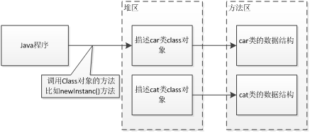
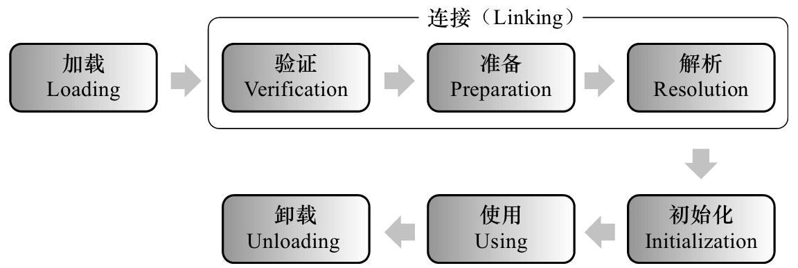
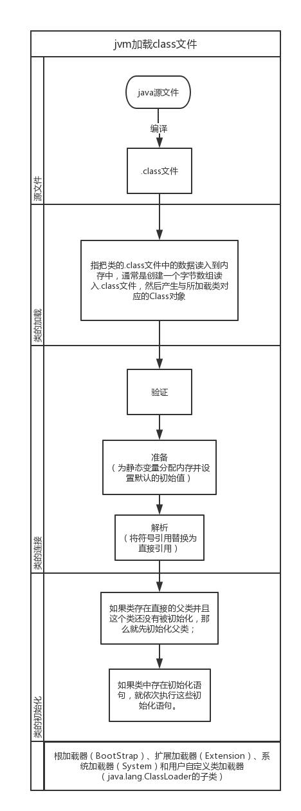
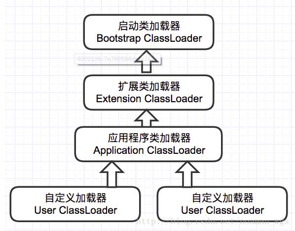

> 摘自：[https://blog.csdn.net/qq_16216221/article/details/71600535](https://blog.csdn.net/qq_16216221/article/details/71600535)  
> 摘自：[http://www.importnew.com/25295.html](http://www.importnew.com/25295.html)
> 摘自：[https://blog.csdn.net/noaman_wgs/article/details/74489549](https://blog.csdn.net/noaman_wgs/article/details/74489549)  
> 摘自：[https://www.cnblogs.com/ityouknow/p/5603287.html](https://www.cnblogs.com/ityouknow/p/5603287.html)

# 一、概述

&emsp;&emsp;类加载是Java程序运行的第一步，研究类的加载有助于了解JVM执行过程，并指导开发者采取更有效的措施配合程序执行，对理解java虚拟机的连接模型和java语言的动态性都有很大帮助。   

&emsp;&emsp;JVM中类的装载是由类加载器（ClassLoader）和它的子类来实现的，Java中的类加载器是一个重要的Java运行时系统组件，它负责在运行时查找和装入类文件中的类。  

&emsp;&emsp;由于Java的跨平台性，经过编译的Java源程序并不是一个可执行程序，而是一个或多个类文件。当Java程序需要使用某个类时，JVM会确保这个类已经被加载、连接（验证、准备和解析）和初始化。  
<!-- more -->

## 1.1 什么是类的加载

&emsp;&emsp;类的加载指的是将类的.class文件中的二进制数据读入到内存中，将其放在运行时数据区的**方法区**内，然后在**堆区**创建一个java.lang.Class对象，用来封装类在方法区内的数据结构。类的加载的最终产品是位于堆区中的Class对象，Class对象封装了类在方法区内的数据结构，并且向Java程序员提供了访问方法区内的数据结构的接口。



&emsp;&emsp;类加载器并不需要等到某个类被“首次主动使用”时再加载它，JVM规范允许类加载器在预料某个类将要被使用时就预先加载它，如果在预先加载的过程中遇到了.class文件缺失或存在错误，类加载器必须在程序首次主动使用该类时才报告错误（LinkageError错误）如果这个类一直没有被程序主动使用，那么类加载器就不会报告错误。

# 二、类的加载过程

  

&emsp;&emsp;其中类加载的过程包括了`加载`、`验证`、`准备`、`解析`、`初始化`五个阶段。在这五个阶段中，`加载`、`验证`、`准备`和`初始化`这四个阶段发生的顺序是确定的，`而解析阶段则不一定`，它在某些情况下可以在初始化阶段之后开始，这是为了支持Java语言的运行时绑定（也成为动态绑定或晚期绑定）。另外注意这里的几个阶段是按顺序开始，而不是按顺序进行或完成，因为这些阶段通常都是互相交叉地混合进行的，通常在一个阶段执行的过程中调用或激活另一个阶段。

## 2.1. 加载

  &emsp;&emsp;加载主要是将.class文件（并不一定是.class。可以是ZIP包，网络中获取）中的二进制字节流读入到JVM中。 
  &emsp;&emsp;在加载阶段，JVM需要完成3件事： 
  &emsp;&emsp;&emsp;1）通过类的全限定名获取该类的二进制字节流； 
  &emsp;&emsp;&emsp;2）将字节流所代表的静态存储结构转化为方法区的运行时数据结构； 
  &emsp;&emsp;&emsp;3）在内存中生成一个该类的java.lang.Class对象，作为方法区这个类的各种数据的访问入口。

&emsp;&emsp;加载阶段完成后，虚拟机外部的二进制字节流就按照虚拟机所需的格式存储在`方法区`之中，而且在`Java堆`中也创建一个`java.lang.Class类的对象（运行时的类型信息）`，这样便可以通过该对象访问方法区中的这些数据。

## 2.2 连接

### 2.2.1. 验证

&emsp;&emsp;验证是连接阶段的第一步，主要确保加载进来的字节流符合JVM规范。 
&emsp;&emsp;验证阶段会完成以下4个阶段的检验动作： 
&emsp;&emsp;&emsp;1）文件格式验证 
&emsp;&emsp;&emsp;2）元数据验证(是否符合Java语言规范) 
&emsp;&emsp;&emsp;3）字节码验证（确定程序语义合法，符合逻辑） 
&emsp;&emsp;&emsp;4）符号引用验证（确保下一步的解析能正常执行）

### 2.2.2. 准备

&emsp;&emsp;准备阶段是正式为`类变量`分配内存并设置类变量的`初始值`阶段，即在方法区中分配这些变量所使用的内存空间。注意这里所说的初始值概念，比如一个类变量定义为：

```java
public static int v = 8080;
```

&emsp;&emsp;实际上变量v在准备阶段过后的初始值为`0`而不是`8080`，将v赋值为8080的putstatic指令是程序被编译后，存放于类构造器<client>方法之中。
但是注意如果声明为：

```java
public static final int v = 8080;
```

&emsp;&emsp;在编译阶段会为v生成`ConstantValue`属性，在准备阶段虚拟机会根据`ConstantValue`属性将v赋值为8080。

### 2.2.3. 解析

&emsp;&emsp;解析阶段是指虚拟机将常量池中的`符号引用`替换为`直接引用`的过程。符号引用就是class文件中的：

```text
CONSTANT_Class_info
CONSTANT_Field_info
CONSTANT_Method_info
```

等类型的常量。  
下面我们解释一下符号引用和直接引用的概念：  
&emsp;&emsp;`符号引用`与虚拟机实现的布局无关，引用的目标并不一定要已经加载到内存中。各种虚拟机实现的内存布局可以各不相同，但是它们能接受的符号引用必须是一致的，因为符号引用的字面量形式明确定义在Java虚拟机规范的Class文件格式中。
&emsp;&emsp;`直接引用`可以是指向目标的`指针`，相对`偏移量`或是一个能间接定位到目标的`句柄`。如果有了直接引用，那引用的目标必定已经在内存中存在。

## 2.3 初始化

&emsp;&emsp;初始化阶段是类加载过程的最后一步，主要是根据程序中的赋值语句主动为类变量赋值。 

&emsp;&emsp;&emsp;注： 

&emsp;&emsp;&emsp;`1）当有父类且父类为初始化的时候，先去初始化父类`； 
&emsp;&emsp;&emsp;`2）再进行子类初始化语句`。

# 三、Jvm加载的过程图例

  

## 什么时候需要对类进行初始化？

1）使用new该类实例化对象的时候； 
2）读取或设置类静态字段的时候（但被final修饰的字段，在编译器时就被放入常量池的静态字段除外static final）； 
3）调用类静态方法的时候； 
4）使用反射Class.forName(“xxxx”)对类进行反射调用的时候，该类需要初始化； 
5）初始化一个类的时候，有父类，先初始化父类（注：1. 接口除外，父接口在调用的时候才会被初始化；2.子类引用父类静态字段，只会引发父类初始化）； 
6）被标明为启动类的类（即包含main()方法的类）要初始化； 
7）当使用JDK1.7的动态语言支持时，如果一个java.invoke.MethodHandle实例最后的解析结果REF_getStatic、REF_putStatic、REF_invokeStatic的方法句柄，并且这个方法句柄所对应的类没有进行过初始化，则需要先触发其初始化。

## 什么时候不会初始化？

1）通过子类引用父类的静态字段，只会触发父类的初始化，而不会触发子类的初始化。
2）定义对象数组，不会触发该类的初始化。
3）常量在编译期间会存入调用类的常量池中，本质上并没有直接引用定义常量的类，不会触发定义常量所在的类。
4）通过类名获取Class对象，不会触发类的初始化。
5）通过Class.forName加载指定类时，如果指定参数initialize为false时，也不会触发类初始化，其实这个参数是告诉虚拟机，是否要对类进行初始化。
6）通过ClassLoader默认的loadClass方法，也不会触发初始化动作。

# 四、类加载器

类加载器负责对类的加载，加载类的方式有：
1）从本地系统直接加载
2）通过网络下载.class文件
3）从zip，jar等归档文件中加载.class文件
4）从专有数据库中提取.class文件
5）将Java源文件动态编译为.class文件（服务器）  

    
