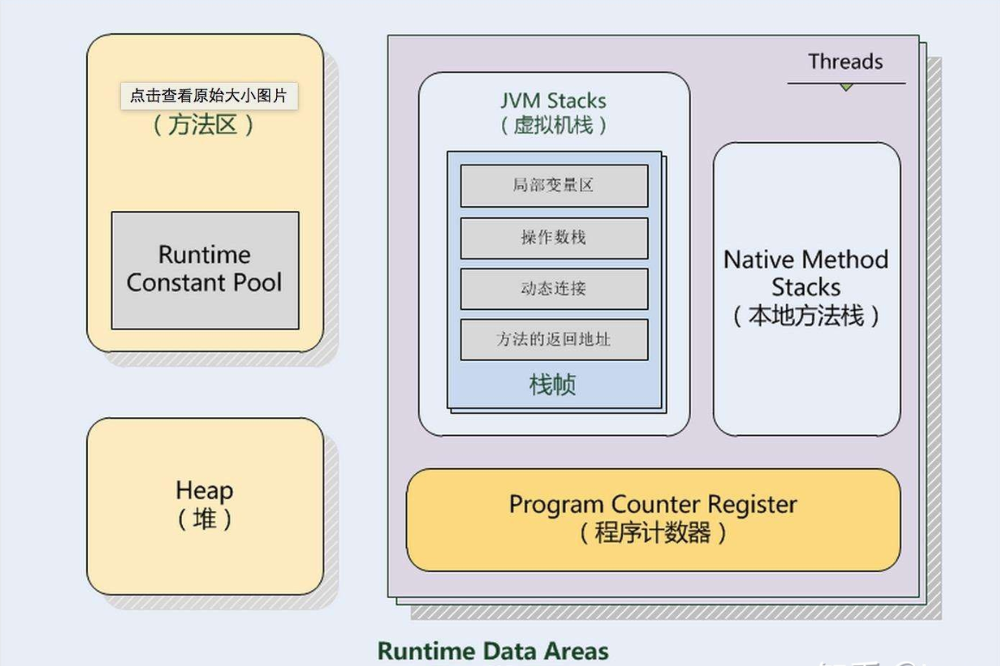

> 摘自：[https://www.cnblogs.com/cjsblog/p/9850300.html](https://www.cnblogs.com/cjsblog/p/9850300.html)
> 摘自：[https://blog.csdn.net/itermeng/article/details/74977888](https://blog.csdn.net/itermeng/article/details/74977888)
> 摘自：[(https://blog.csdn.net/laomo_bible/article/details/83067810](https://blog.csdn.net/laomo_bible/article/details/83067810)

# 运行时区域内存

&emsp;&emsp;Java虚拟机在执行Java程序时会将其管理的区域划分为不同的数据区域，不同区域之间拥有各自用途、创建和销毁的时间，有的区域随着虚拟机进程的启动而存在，而有的区域则依赖用户线程的生命周期。

| 名称     | 特征                           | 作用                                      | 配置参数                   | 异常                                       |
|:------ |:---------------------------- |:--------------------------------------- |:---------------------- |:---------------------------------------- |
| 程序计数器  | 占用内存小，线程私有，生命周期与线程相同         | 大致为字节码行号指示器                             | 无                      | 无                                        |
| 虚拟机栈   | 线程私有，生命周期与线程相同，使用连续的内存空间     | Java 方法执行的内存模型，存储局部变量表、操作栈、动态链接、方法出口等信息 | -Xss                   | StackOverflowError  OutOfMemoryError |
| java堆  | 线程共享，生命周期与虚拟机相同，可以不使用连续的内存地址 | 保存对象实例，所有对象实例（包括数组）都要在堆上分配              | -Xms -Xsx -Xmn | OutOfMemoryError                         |
| 方法区    | 线程共享，生命周期与虚拟机相同，可以不使用连续的内存地址 | 存储已被虚拟机加载的类信息、常量、静态变量、即时编译器编译后的代码等数据    |                        | OutOfMemoryError                         |
| 运行时常量池 | 方法区的一部分，具有动态性                | 存放字面量及符号引用                              | &nbsp;                 | &nbsp;                                   |
<!--more -->

------

## 1. 程序计数器

### （1）含义作用

&emsp;&emsp;**程序计数器（Program Counter Register）**是一块较小的内存空间，可以看作是当前线程所执行的字节码的行号指示器。在虚拟机概念模型中，字节码解释器工作时就是通过改变计数器的值来选取下一条需要执行的字节码指令，分支、循环、跳转、异常处理、线程恢复等基础功能都需要依赖计数器。

### （2）计数器与多线程

&emsp;&emsp;由于JVM的多线程时通过线程轮流切换并分配处理器执行时间的方式来实现的，在任何一个确定的时刻，一个处理器（对于多核处理器来说是一个内核）都只会执行一条线程中的指令。所以，为了线程切换后能恢复到正确的执行位置，每条线程需要一个独立的程序计数器，各线程之间计数器互不影响、独立存储，相当于是一块“`线程私有`”的内存。

### **（3）虚拟机规范记录（有关异常）**

&emsp;&emsp;若线程正在执行的是一个**Java**方法，这个计数器记录的时正在执行的虚拟机字节码指令的地址；若执行的是**Native**方法，则计数器为空（Undefined）。注意：此内存区域是唯一一个在Java虚拟机规范中没有规定任何 **OutOfMemoryError**情况的区域。

------

## 2 . Java虚拟机栈

### **（1）含义作用**

&emsp;&emsp;同程序计数器相同，**Java虚拟机栈（Java Virtual Machine Stacks）**也是`线程私有`的，它的生命周期与线程相同。虚拟机栈描述的是Java方法执行的内存模型：每个方法在执行的同时都会创建一个栈帧用于存储**局部变量表、操作数栈、动态链接、方法出口**等信息。每一个方法从调用直至执行完成的过程，会对应一个栈帧在虚拟机栈中入栈到出栈的过程。

### **（2）Java内存区分误区**

&emsp;&emsp;大多数人以为Java内存区分为堆内存（`Heap`）和栈内存（`Stack`），这是一种误区，Java内存区域的划分远比这种粗糙的分法更加复杂。这种划分方式广泛流传是由于大多数开发者关注与对象内存分配关系最密切的内存区域就是这两块，有关“堆”的知识后续载提，这里的“栈”指的就是虚拟机栈，或者说是虚拟机栈中的变量表部分。

### **（3）虚拟机栈中的局部变量表**

&emsp;&emsp;局部变量表中存放了编译期可知的

- **八大数据类型**（boolean、byte、char、short、int、float、long、double）。

- **对象引用**（reference类型，它不等于对象本身，可能是一个指向对象起始地址的指针，也可能是指向一个代表对象的句柄或其他与此对象相关的位置）

- **returnAddress类型**（指向了一条字节码指令的地址）

&emsp;&emsp;其中64位长度的`long`和`double`类型的数据会占用2个局部变量空间（Slot），其余数据类型只占用1个。**局部变量表所需的内存控件在编译期间完成分配**，当进入一个方法时，这个方法需要在帧中分配多大的局部变量空间是完全确定的，在方法运行期间不会改变局部变量表的大小。

### **（4）虚拟机规范记录（有关异常）**

&emsp;&emsp;在Java虚拟机规范中，对这个区域规定了两种异常状况：

- 若线程请求的栈深度大于虚拟机所允许的深度，将抛出**StackOverflowError**异常。

- 若虚拟机可以动态扩展（当前大部分Java虚拟机都可动态扩展，只不过Java虚拟机规范也允许固定长度的虚拟机栈），当扩展时无法申请到足够的内存，就会抛出**OutOfMemoryError**异常。

------

  

## 3 . 本地方法栈

### **（1）含义作用**

**&emsp;&emsp;本地方法栈（Native Method Stack）**与虚拟机栈所发挥的作用类似，它们之间的区别是：虚拟机栈为虚拟机执行**Java**方法（也就是字节码）服务，而本地方法栈则为虚拟机使用到的**Native**方法服务。

### **（2）虚拟机规范记录（有关异常）**

&emsp;&emsp;在虚拟机规范中对本地方法栈中使用的语言、方式和数据结构并`无强制规定`，因此具体的虚拟机可实现它。甚至有的虚拟机（Sun HotSpot虚拟机）直接把本地方法栈和虚拟机栈合二为一。

&emsp;&emsp;与虚拟机一样，本地方法栈会抛出**StackOverflowError**和**OutOfMemoryError**异常。

------

## 4 . Java堆

### **（1）含义作用**

&emsp;&emsp;对于大多数应用而言，**Java堆（Heap）**是Java虚拟机所管理的内存中最大的一块，它是被**所有线程共享**的一块内存区域，在虚拟机启动时创建。**此内存区域唯一的目的是存放对象实例**，几乎所有的对象实例都在这里分配内存。Java虚拟机规范中描述道：所有的对象实例以及数组都要在堆上分配，但是随着JIT编译器的发展和逃逸分析技术逐渐成熟，栈上分配、标量替换优化技术将会导致一些微妙的变化发生，*所有的对象都在堆上分配的定论也并不“绝对”了*。

### **（2）Java堆与垃圾回收器**

**&emsp;&emsp;Java堆**是垃圾回收器管理的主要区域，因此被称为“GC堆”（`Garbage Collected Heap`）。

&emsp;&emsp;从内存回收角度看，由于目前收集器基本采用分代收集算法，所以Java堆可细分为：新生代和老年代。
&emsp;&emsp;从内存分配角度来看，线程共享的Java堆中可能划分出多个线程私有的分配缓冲区（TLAB：Thread Local Allocation Buffer）。
&emsp;&emsp;不过无论如何划分，都与存放内容无关，无论哪个区域，存放的都是对象实例，进一步划分目的是为了更好地回收内存，或者是更快地分配内存。此节仅对内存区域作用进行学习，Java堆上各个区域分配回收等细节与内存分配策略有关，后续讲解。

### （3）虚拟机规范记录（有关异常）

&emsp;&emsp;根据Java虚拟机规范的规定，Java堆可以处于物理上不连续的内存中，只要逻辑上是连续的即可，就像磁盘空间。在实现时，可以实现成固定大小或可扩展的，不过当前主流虚拟机是按照可扩展进行实现的（通过-Xmx和 -Xms控制）。

&emsp;&emsp;若堆中没有内存完成实例分配，并且堆也无法扩展时，将会抛出**OutOfMemoryError**异常。

------

##  5 . 方法区

### **（1）含义作用**

**&emsp;&emsp;方法区（Method Area）**与Java堆一样，是各个**线程共享**的内存区域，它用于存储已被虚拟机加载的**类信息**、**常量**、**静态变量**、**即时编译器编译后的代码**等数据。虽然Java虚拟机规范把方法区描述为堆的一个逻辑部分，但是它有一个别名叫做 *Non-Heap（非堆）*，目的是为了和*Java堆*区分开来。

&emsp;&emsp;从jdk1.7已经开始准备`“去永久代”`的规划，**jdk1.7的HotSpot中，已经把原本放在方法区中的静态变量、字符串常量池等移到堆内存中。**

#### PermGen（永久代）

&emsp;&emsp;**方法区**是`JVM的规范`，而**永久代**是方法区的一种实现，并且`只有HotSpot才有PermGen space`，而对于其他类型的虚拟机并没有`PermGen space`。

&emsp;&emsp;在JDK1.8中，HotSpot已经没有`PermGen space`这个区间了，取而代之是`Metaspace（元空间）`

#### Metaspace（元空间）

&emsp;&emsp;在JDK1.8中，`永久代`已经不存在，存储的**类信息、编译后的代码数据**等已经移动到了**MetaSpace（元空间）**中，元空间并没有处于`堆内存上`，而是直接占用的`本地内存`（NativeMemory）。

&emsp;&emsp;元空间的本质和永久代类似，都是对JVM规范中方法区的实现。不过元空间与永久代之间最大的区别在于：**元空间并不在虚拟机中，而是使用本地内存**。

&emsp;&emsp;元空间的大小**仅受本地内存限制**，可以通过以下参数来指定元空间大小：

- **-XX:MetaspaceSize**，初始空间大小，达到该值就会触发垃圾收集进行类型卸载，同时GC会对该值进行调整：如果释放了大量的空间，就适当降低该值；如果释放了很少的空间，那么在不超过`MaxMetaspaceSize`时，适当提高该值
- **-XX:MaxMetaspaceSize**，最大空间，默认是没有限制的
- **-XX:MinMetaspaceFreeRatio**，在GC之后，最小的Metaspace剩余空间容量的百分比，减少为分配空间所导致的垃圾收集
- **-XX:MaxMetaspaceFreeRatio**，在GC之后，最大的Metaspace剩余空间容量的百分比，减少为释放空间所导致的垃圾收集

### **（2）虚拟机规范记录（有关异常）**

&emsp;&emsp;Java虚拟机规范对方法区的限制非常宽松，除了和Java堆一样不需要连续的内存和可以选择固定大小或可扩展外，还可以选择不实现垃圾收集。相对而言，垃圾收集行为在这个区域比较少见。**此区域的内存回收目标主要是针对常量池的回收和对类型的卸载**，一般来说，回收效果难以令人满意，尤其是类型的卸载，条件相对苛刻，但是这部分区域回收是有必要的。

&emsp;&emsp;根据Java虚拟机规范的规定，当方法无法满足内存需求时，将会抛出**OutOfMemoryError**异常。

## 6 . 运行时常量池

### （1）含义作用

&emsp;&emsp;**运行时常量池（Runtime Constant Pool）**是**方法区**的一部分。Class文件中除了有类的版本、字段、方法、接口等描述信息外，还有一项信息是**常量池（Constant Pool Table）**，用于存放编译期生成的各种字面量和符号引用，这部分内容将在类加载后进入方法区的运行时常量池存放。

### （2）运行时常量池和Class文件

&emsp;&emsp;Java虚拟机对Class文件每一部分（自然包括常量池）的格式有严格规定，每一个字节用于存储那种数据都必须符合规范上的要求才会被虚拟机认可、装载和执行。但对于运行时常量池，Java虚拟机规范没有做任何有关细节的要求，不同的提供商实现的虚拟机可以按照自己的需求来实现此内存区域。不过一般而言，除了保存Class文件中的描述符号引用外，还会把翻译出的直接引用也存储在运行时常量池中。

&emsp;&emsp;运行时常量池相对于Class文件常量池的另外一个重要特征是**具备动态性**，Java语言并不要求常量一定只有编译器才能产生，也就是并非置入Class文件中的常量池的内容才能进入方法区运行时常量池，运行期间也可能将新的常量放入池中，此特性被开发人员利用得比较多的便是String类的intern() 方法。

### （3）虚拟机规范记录（有关异常）

&emsp;&emsp;运行时常量池是方法区的一部分，自然受到方法区的内存限制，当常量池无法再申请到内存时会抛出**OutOfMemoryError**异常。

------

## 7 . 直接内存
### （1）含义作用

&emsp;&emsp;**直接内存（Direct Memory）**并不是虚拟机运行时数据的一部分，也不是Java虚拟机规范中定义的内存区域。但这部分内存也被频繁运用，而却可能导致**OutOfMemoryError**异常出现。

### （2）有关异常

&emsp;&emsp;本机直接内存的分配不会受到Java堆大小的限制，但是既然是内存，还是会受到本机总内存（包括RAM以及SWAP区或分页文件）大小以及处理器寻址空间的限制。服务器管理员在配置虚拟机参数时，会根据实际内存设置-Xmx等参数信息，但经常忽略直接内存，使得各个内存区域总和大于物理内存限制（包括物理的和操作系统的限制），从而导致动态扩展时出现**OutOfMemoryError**异常。

