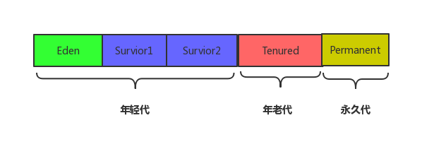
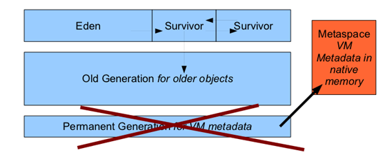
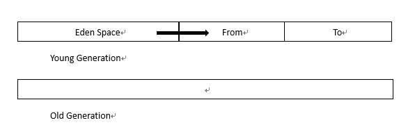
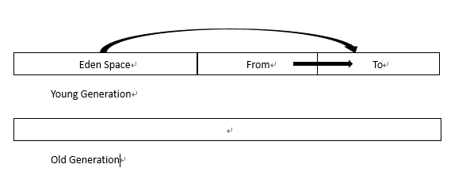
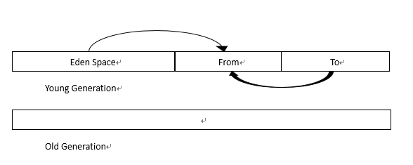
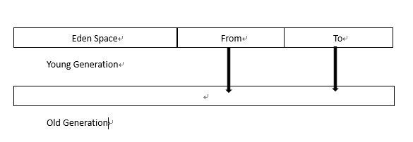

> 摘自：[https://blog.csdn.net/en_joker/article/details/79737533](https://blog.csdn.net/en_joker/article/details/79737533)
> 摘自：[https://www.cnblogs.com/cjsblog/p/9850300.html](https://www.cnblogs.com/cjsblog/p/9850300.html)
> 摘自：[https://lhc1986.iteye.com/blog/1421832](https://lhc1986.iteye.com/blog/1421832)

# 堆内存划分

&emsp;&emsp;在`JDK1.7`以及其前期的JDK版本中，堆内存通常被分为三块区域：**Young Generation**、**Old Generation**、**Permanent Generation for VM Matedata**

&emsp;&emsp;在JDK1.8中把存放元数据中的永久内存从堆内存中移到了本地内存中，JDK1.8中JVM堆内存结构就变成了如下：

<!-- more -->

# 分代收集算法

&emsp;&emsp;当前商业虚拟机的垃圾收集都采用**“分代收集”（Generational Collection）算法**，这种算法并没有什么新的思想，只是根据对象存活周期的不同将内存划分为几块。一般是把Java堆分为**新生代**和**老年代**，这样就可以根据各个年代的特点采用最适合的收集算法。在新生代中，每次垃圾收集时都发现有大批对象死去，只有少量存活，那就选用**复制算法**，只需要付出少量存活对象的复制成本就可以完成。而老年代中因为对象存活率高、没有额外空间对他进行分配担保，就必须使用“**标记-清理”**或者“**标记-整理**”算法来进行回收。

1. 一个人（**对象**）出来（**new** 出来）后会在**Eden Space**`（伊甸园）`无忧无虑的生活，直到GC（`YoungGC`）到来打破了他们平静的生活。GC（`YoungGC`）会逐一问清楚每个**对象**的情况，有没有钱（此对象的**引用**）啊，因为GC想赚钱呀，有钱的才可以敲诈嘛。然后富人就会进入**Survivor Space**（`幸存者区`），穷人的就直接kill掉。

   &emsp;&emsp;(1)  **把还存活的对象复制到From区**

   

   &emsp;&emsp;(2)  **当Eden区再次被用完，就再触发一次YoungGC，会将Eden区与From区还在被使用的对象复制到To区**

      
   &emsp;&emsp;(3)  **再触发YoungGC，Eden区与To区中的还在被使用的对象复制到From区**

   

2. 并不是进入**Survivor Space（**`幸存者区）`后就保证人身是安全的，但至少可以活段时间。GC（`YoungGC`）会定期（可以自定义）会对这些人进行敲诈，亿万富翁每次都给钱，GC（`YoungGC`）很满意，就让其进入了**Genured Gen**(`养老区`)。万元户经不住几次敲诈就没钱了，GC（`YoungGC`）看没有啥价值啦，就直接kill掉了。

   

3. 进入到养老区的人基本就可以保证人身安全啦，但是亿万富豪有的也会挥霍成穷光蛋，只要钱没了（**空间耗尽**），GC（`Full GC`）还是kill掉。

