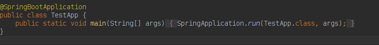
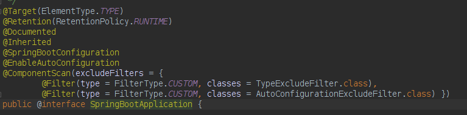
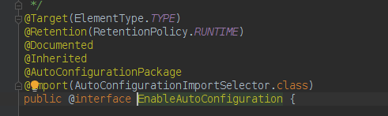

SpringBoot 自动配置主要通过 `@EnableAutoConfiguration`, `@Conditional`, `@EnableConfigurationProperties` 或者 `@ConfigurationProperties `等几个注解来进行自动配置完成的。

`@EnableAutoConfiguration` 开启自动配置，主要作用就是调用 `Spring-Core` 包的 `loadFactoryNames()`，将 `autoconfig` 包里的已经写好的自动配置加载进来。  

`@Conditional` 条件注解，通过判断类路径下有没有相应配置的 `jar` 包来确定是否加载和自动配置这个类。  

`@EnableConfigurationProperties` 的作用就是，给自动配置提供具体的配置参数，只需要写在 `application.properties`或`application.yml` 中，就可以通过映射写入配置类的 `POJO` 属性中。

<!-- more -->

### @EnableAutoConfiguration

事实上是通过通过Spring的`@Import`注释导入。

SpringBoot启动类`@SpringBootApplication`



进入`@SpringBootApplication`注解类，发现使用了注解`@EnableAutoConfiguration`



最终发现`@EnableAutoConfiguration`里使用了Spring的`@Import`注解导入了`AutoConfigurationImportSelector`类



找到`selectImports()`方法，它调用了`getAutoConfigurationEntry `方法，`getAutoConfigurationEntry `方法又调用了`getCandidateConfigurations()`方法，这个方法又调用了spring-core包中的`SpringFactoriesLoader.loadFactoryNames`方法。这个方法的作用是，会加载所有JAR包中的`META-INF/spring.factories`文件，并加载其中以`EnableAutoConfiguration.class`全类名为key的自动配置文件类名列表

### `selectImports`方法

```java
@Override
public String[] selectImports(AnnotationMetadata annotationMetadata) {
    if (!isEnabled(annotationMetadata)) {
        return NO_IMPORTS;
    }
    //得到注解信息
    AutoConfigurationMetadata autoConfigurationMetadata = AutoConfigurationMetadataLoader
        .loadMetadata(this.beanClassLoader);
    //得到配置配置列表
    AutoConfigurationEntry autoConfigurationEntry = getAutoConfigurationEntry(
        autoConfigurationMetadata, annotationMetadata);
    return StringUtils.toStringArray(autoConfigurationEntry.getConfigurations());
}
```
### `getAutoConfigurationEntry`方法

```java
/**
* Return the {@link AutoConfigurationEntry} based on the {@link AnnotationMetadata}
* of the importing {@link Configuration @Configuration} class.
* @param autoConfigurationMetadata the auto-configuration metadata
* @param annotationMetadata the annotation metadata of the configuration class
* @return the auto-configurations that should be imported
*/
protected AutoConfigurationEntry getAutoConfigurationEntry(
    AutoConfigurationMetadata autoConfigurationMetadata,
    AnnotationMetadata annotationMetadata) {
    if (!isEnabled(annotationMetadata)) {
        return EMPTY_ENTRY;
    }
    //得到注解属性
    AnnotationAttributes attributes = getAttributes(annotationMetadata);
    //得到候选配置列表
    List<String> configurations = getCandidateConfigurations(annotationMetadata,
                                                             attributes);
    //去重
    configurations = removeDuplicates(configurations);
    //排序注解配置的exclude或excludeName/读取配置spring.autoconfigure.exclude
    Set<String> exclusions = getExclusions(annotationMetadata, attributes);
    checkExcludedClasses(configurations, exclusions);
    configurations.removeAll(exclusions);
    //调用 filter 进行过滤 OnBeanCondition/OnClassCondition/OnWebApplicationCondition
    configurations = filter(configurations, autoConfigurationMetadata);
    //
    fireAutoConfigurationImportEvents(configurations, exclusions);
    return new AutoConfigurationEntry(configurations, exclusions);
}
```

